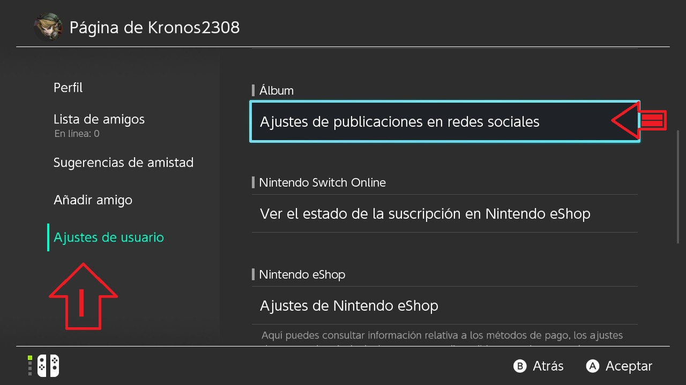

# NXBrowserMod

Put this in:

/atmosphre/contents/

or

/sxos/tiles/

use the 90Dns

```
163.172.141.219
```
```
207.246.121.77
```

And try to send a picture from the album With 

or go to

profile -> user settings -> settings sosial media

perfil -> ajustes de usuario -> ajustes de publicasiones en redes sociales



* A nintendo [account](https://github.com/StarDustCFW/StarDust-Toolkit/releases/latest) is required 

**Features:**

 * Go to internet Explorer from the album or de user profile
 * Confortable interface
 * video playback
 * save logins and pass
 
**Credits:**

Migush for the [original idea](https://github.com/Migushthe2nd/eBrowserMod)
